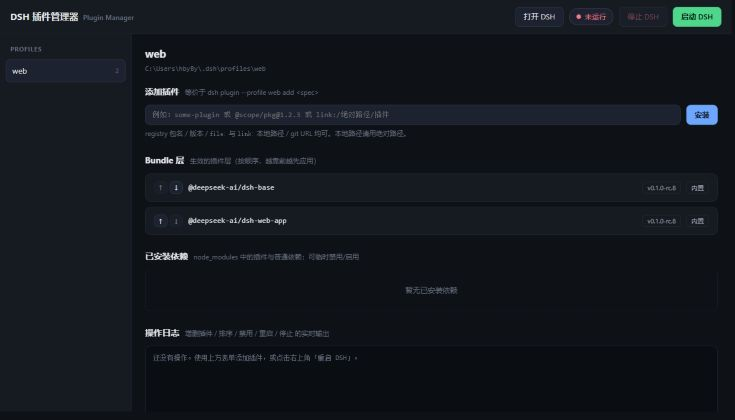

# DSH 插件管理器

一个本地网页工具，用来图形化管理 DSH 插件，并快速启动、停止或重启 `dsh web`。



## 功能

- 安装、移除和临时禁用插件
- 调整 Bundle 层顺序
- 切换不同 profile
- 启动、停止、重启或打开 DSH
- 实时查看操作日志

## 下载与运行

前往 [GitHub Releases](https://github.com/lsby/dsh-plugin-manager/releases/latest) 下载对应系统的压缩包：

- Windows：`dsh-plugin-manager-win32-x64.zip`
- Apple 芯片 Mac：`dsh-plugin-manager-darwin-arm64.zip`
- Intel 芯片 Mac：`dsh-plugin-manager-darwin-x64.zip`

解压后，Windows 双击 `start.cmd`，macOS 双击 `start.command`。浏览器会自动打开 [http://127.0.0.1:3929](http://127.0.0.1:3929)。

## 用法

1. 左侧选择 profile。
2. 在「添加插件」中输入包名、版本、git URL，或 `file:` / `link:` 路径，然后点击「安装」。
3. 在插件列表中调整顺序、禁用或移除插件；需要生效时点击右上角「重启 DSH」。

> 本地插件请使用绝对路径。管理器只监听 `127.0.0.1`，没有远程访问鉴权。

## 源码运行

在项目目录执行 `npm start`。默认端口为 `3929`，也可以手动指定：

```bash
node server.js --port 8081
```
